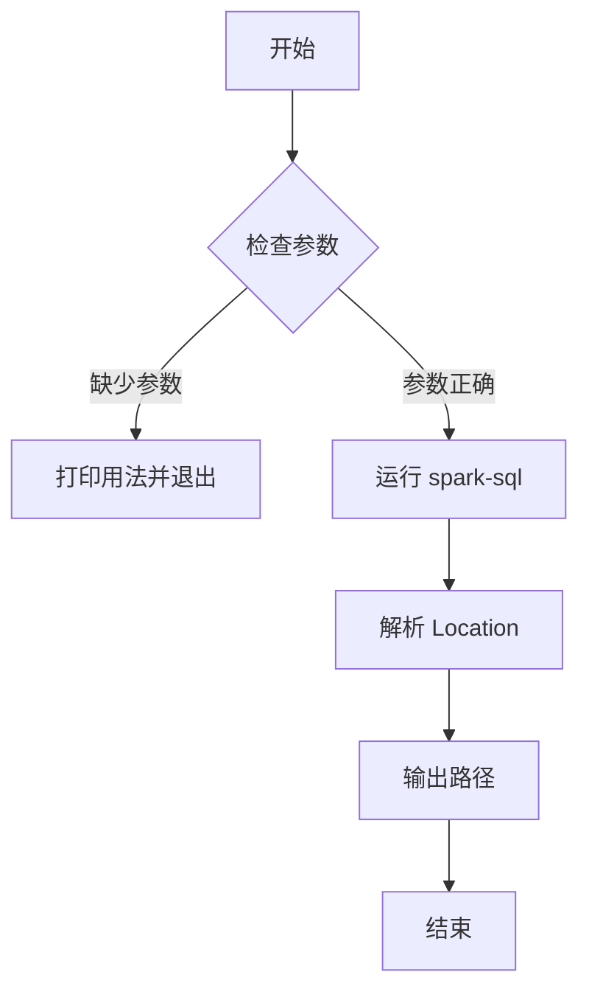
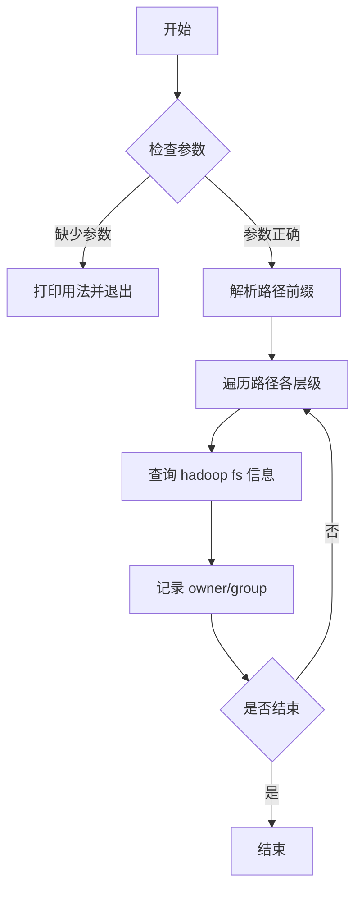
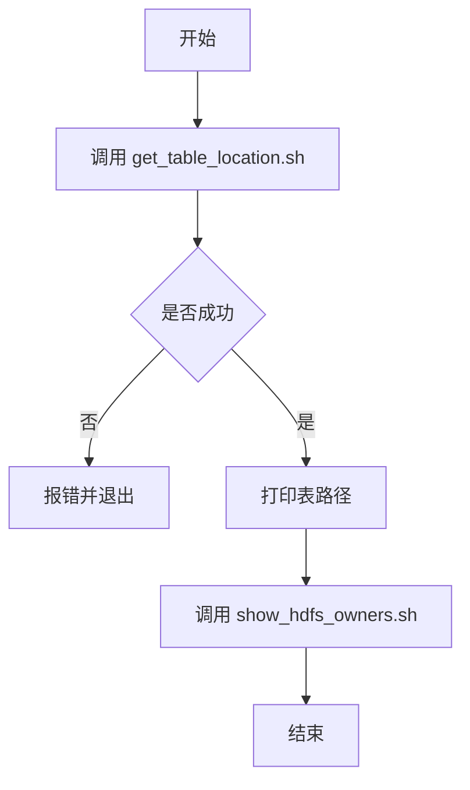
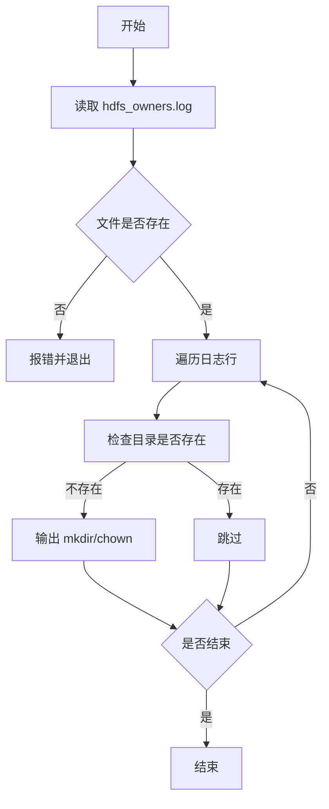
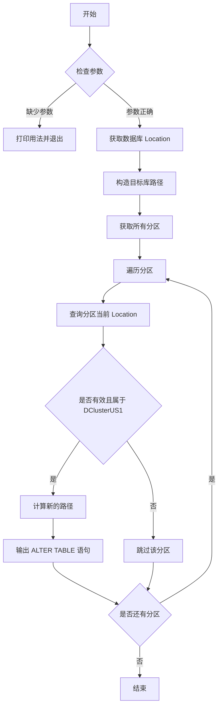

# hns-migrator

(hive ns 迁移工具) Hive NameService Migrator

## Scripts

The `us_scripts` directory contains small utilities used during HDFS
namespace migrations.

### `get_table_location.sh`
Query Hive for the location of a table using `spark-sql --master local`.

```bash
./us_scripts/get_table_location.sh <database.table>
```

### `show_hdfs_owners.sh`
Display the owner and group for every level of a given HDFS path and
record the information to `hdfs_owners.log` in the `scripts` directory.

```bash
./us_scripts/show_hdfs_owners.sh <hdfs-path>
```

The output file contains lines of the form `path owner group` which can be
used by other utilities.

### `get_table_info.sh`
Convenience wrapper that combines the above steps and prints the table
location and ownership information.

```bash
./us_scripts/get_table_info.sh <database.table>
```

Each script exits with an error message if required arguments are not
provided.

### `verify_paths.sh`
Read the `hdfs_owners.log` file generated by `show_hdfs_owners.sh`, replace
`DClusterUS1` with the specified cluster name and output the `hadoop` commands
needed to create and set ownership for each missing path (up to the second to
last level).

```bash
./us_scripts/verify_paths.sh <new-cluster>
```

### `gen_part_set_location.sh`
Generate `ALTER TABLE ... PARTITION ... SET LOCATION` statements for all
partitions of a table, adjusting paths from `DClusterUS1` to `DClusterUS2`.

```bash
./us_scripts/gen_part_set_location.sh <database.table>
```

## 中文脚本说明与流程图

以下内容对仓库中的每个脚本进行了中文说明，并使用 Mermaid 绘制了相应的流程图，方便快速了解脚本的执行步骤。

### get_table_location.sh

该脚本通过 `spark-sql` 查询指定表的 `Location` 信息。



### show_hdfs_owners.sh

递归遍历指定的 HDFS 路径，输出各级目录的所有者和所属组，同时记录到 `hdfs_owners.log`。



### get_table_info.sh

该脚本组合使用 `get_table_location.sh` 和 `show_hdfs_owners.sh`，先获取表路径，再查看 HDFS 目录的权限信息。



### verify_paths.sh

根据 `hdfs_owners.log` 的内容，在目标集群上生成需要创建目录及设置权限的 `hadoop` 命令。



### gen_part_set_location.sh

该脚本查询某张分区表的所有分区，并生成将分区 `location` 从 `DClusterUS1` 调整到 `DClusterUS2` 的 `ALTER TABLE ... SET LOCATION` 语句，仅生成 SQL 不直接执行。


